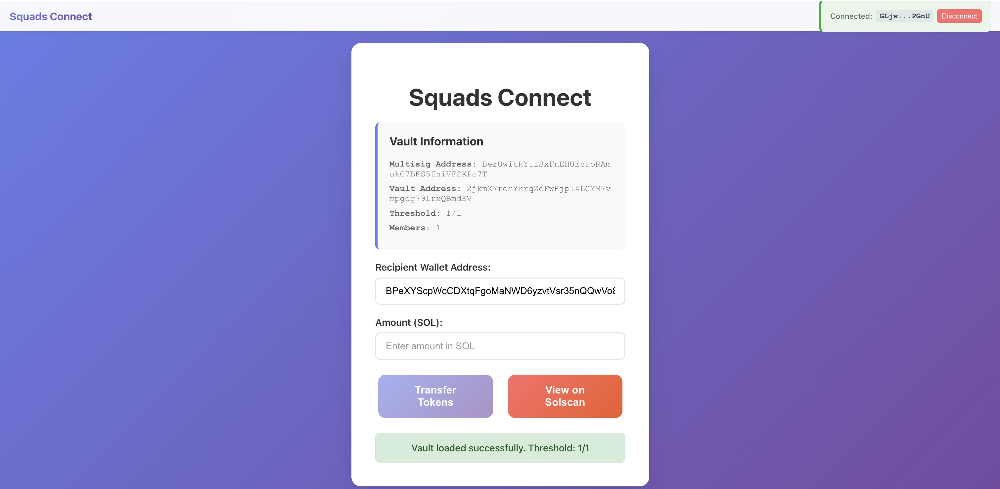
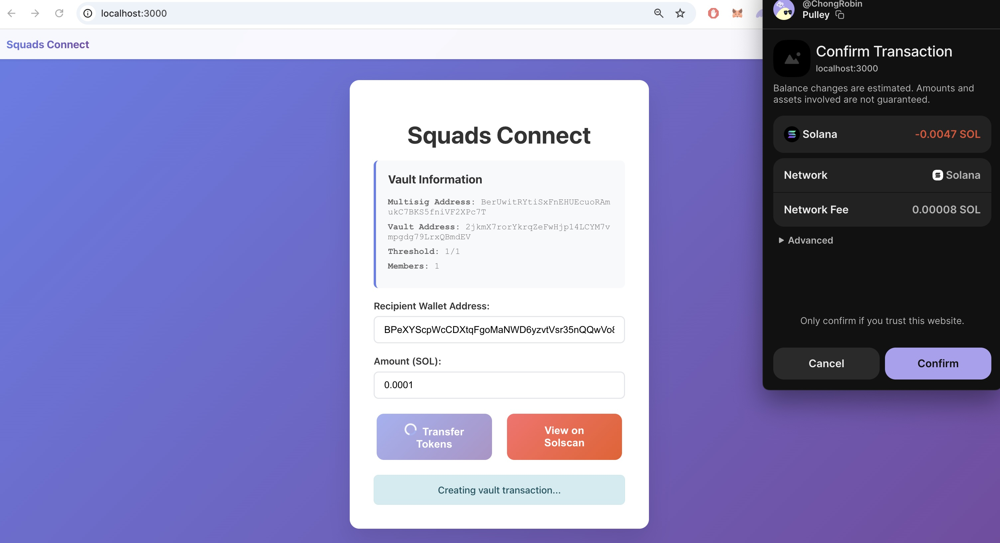

# Squads Connect - Token Transfer App

A React.js application for connecting to Squads vaults and creating transaction proposals using Phantom wallet integration. This app creates transaction proposals that appear in the Squads app for multisig approval.

## Features

- 🔗 Connect to Squads vault using Phantom wallet
- 💰 Create SOL transfer proposals from vault
- 🔐 Multisig transaction proposal creation using Squads v4 SDK
- 🌐 Mainnet-ready configuration
- 📱 Clean and intuitive UI with responsive design
- 🔍 Integration with Solscan explorer
- ⚡ Uses @sqds/multisig package for transaction creation
- 🛡️ Browser compatibility with Buffer polyfills

## Screenshots

### Main Application Interface


### Phantom Wallet Pop up for Token Transfer


## Setup

1. **Install dependencies:**
   ```bash
   npm install
   ```

2. **Configure environment variables:**
   Copy `env.example` to `.env` and update the values:
   ```bash
   cp env.example .env
   ```

   Update the following variables in `.env`:
   - `REACT_APP_MULTISIG_ACCOUNT`: Your Squads multisig account address
   - `REACT_APP_RECIPIENT_WALLET`: Default recipient wallet address
   - `REACT_APP_RPC_URL`: Solana RPC endpoint (default: mainnet)

3. **Install Phantom Wallet:**
   - Download and install the [Phantom wallet extension](https://phantom.app/)
   - Create or import your wallet

## Usage

1. **Start the development server:**
   ```bash
   npm start
   ```

2. **Connect your wallet:**
   - Click "Connect Phantom Wallet"
   - Approve the connection in Phantom

3. **Create transfer proposal:**
   - Enter recipient wallet address
   - Enter amount to transfer (in SOL)
   - Click "Transfer Tokens"
   - Transaction proposal will be created and appear in the Squads app

4. **Approve transaction:**
   - Go to the Squads app at the provided URL
   - Review and approve the transaction with required signatures
   - Transaction executes once threshold is met

5. **View on Solscan:**
   - Click "View on Solscan" to see your vault on the blockchain explorer

## Configuration

### Multisig Account
Your Squads multisig account address from the settings page. This is used to derive the vault address automatically.

### Recipient Wallet
The Solana wallet address that will receive the transferred tokens.

## Security Notes

- This app requires multisig approval for all transfers
- Private keys are never stored or transmitted
- All transactions are signed locally in Phantom wallet
- Vault access requires proper multisig permissions

## Troubleshooting

### Phantom Wallet Not Detected
- Ensure Phantom wallet extension is installed and enabled
- Refresh the page after installing Phantom
- Check that you're using a supported browser

### Connection Issues
- Verify your RPC URL is correct and accessible
- Check that your multisig account address is valid
- Ensure you have proper permissions for the vault

### Buffer is not defined Error
- This error is fixed with the included Buffer polyfills
- If you still see this error, restart the development server
- Ensure `buffer` and `process` packages are installed

### Transaction Proposal Failures
- Verify recipient address is valid
- Check that vault has sufficient balance
- Ensure you're using the correct multisig account address
- Check that the RPC endpoint is working properly

### RPC Access Denied (403 Error)
- Try using a different RPC endpoint in your `.env` file
- Consider using Alchemy, QuickNode, or other RPC providers
- Free RPC endpoints may have rate limits

## Development

Built with:
- React.js 19
- Solana Web3.js
- @sqds/multisig (Squads v4 SDK)
- Phantom Wallet Integration
- Buffer polyfills for browser compatibility

### Key Dependencies
- `@solana/web3.js` - Solana blockchain interaction
- `@sqds/multisig` - Squads Protocol v4 SDK
- `buffer` - Node.js Buffer polyfill for browsers
- `process` - Node.js process polyfill for browsers

### Project Structure
```
src/
├── App.js          # Main application component
├── App.css         # Component-specific styles
├── index.js        # App entry point with polyfills
└── index.css       # Global styles
```

## License

MIT License
